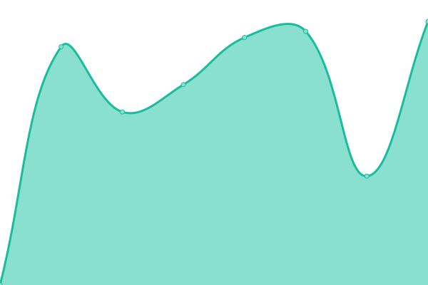
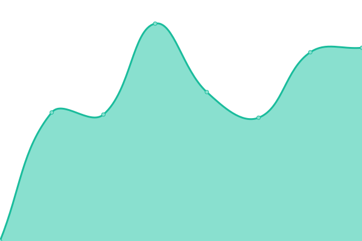
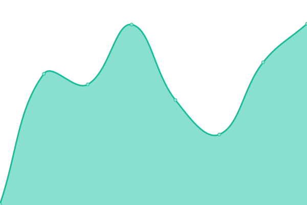

# [📈 Live Status](https://status.element-gaming.eu): <!--live status--> **🟩 All systems operational**

This repository contains the open-source uptime monitor and status page for [Element Gaming](https://element-gaming.eu), powered by [Upptime](https://github.com/upptime/upptime).

With [Upptime](https://upptime.js.org), you can get your own unlimited and free uptime monitor and status page, powered entirely by a GitHub repository. We use [Issues](https://github.com/element-gaming/upptime/issues) as incident reports, [Actions](https://github.com/element-gaming/upptime/actions) as uptime monitors, and [Pages](https://status.element-gaming.eu) for the status page.

<!--start: status pages-->
<!-- This summary is generated by Upptime (https://github.com/upptime/upptime) -->
<!-- Do not edit this manually, your changes will be overwritten -->
<!-- prettier-ignore -->
| URL | Status | History | Response Time | Uptime |
| --- | ------ | ------- | ------------- | ------ |
|  [Website](https://element-gaming.eu) | 🟩 Up | [website.yml](https://github.com/element-gaming/status/commits/HEAD/history/website.yml) | 

 1829ms
     
 | 

<a href="https://status.element-gaming.eu/history/website">100.00%</a>
    

|  [Web App Network](https://app.element-gaming.eu) | 🟩 Up | [web-app-network.yml](https://github.com/element-gaming/status/commits/HEAD/history/web-app-network.yml) | 

 313ms
     
 | 

<a href="https://status.element-gaming.eu/history/web-app-network">100.00%</a>
    

|  [API Service](https://api.element-gaming.eu/api/twitch/online-utils) | 🟩 Up | [api-service.yml](https://github.com/element-gaming/status/commits/HEAD/history/api-service.yml) | 

 540ms
     
 | 

<a href="https://status.element-gaming.eu/history/api-service">100.00%</a>
    

|  [Shortner Service](https://emt.gg) | 🟩 Up | [shortner-service.yml](https://github.com/element-gaming/status/commits/HEAD/history/shortner-service.yml) | 

 3270ms
     
 | 

<a href="https://status.element-gaming.eu/history/shortner-service">100.00%</a>
    

|  [Social links Service](https://links.emt.gg) | 🟩 Up | [social-links-service.yml](https://github.com/element-gaming/status/commits/HEAD/history/social-links-service.yml) | 

 139ms
     
 | 

<a href="https://status.element-gaming.eu/history/social-links-service">100.00%</a>
    

<!--end: status pages-->

[**Visit our status website →**](https://status.element-gaming.eu)

## 📄 License

- Powered by: [Upptime](https://github.com/upptime/upptime)
- Code: [MIT](./LICENSE) © [Element Gaming](https://element-gaming.eu)
- Data in the `./history` directory: [Open Database License](https://opendatacommons.org/licenses/odbl/1-0/)
