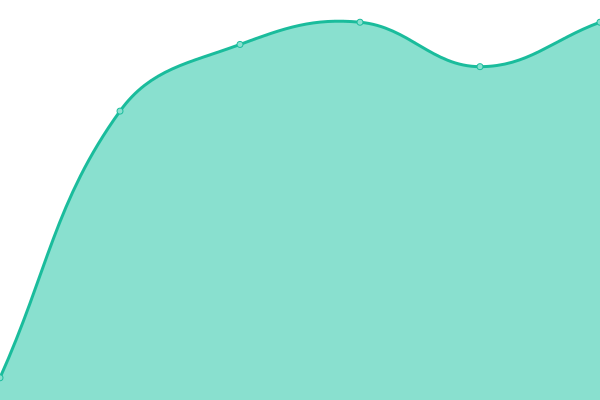

# [📈 Live Status](https://status.element-gaming.eu): <!--live status--> **🟥 Complete outage**

This repository contains the open-source uptime monitor and status page for [Element Gaming](https://element-gaming.eu), powered by [Upptime](https://github.com/upptime/upptime).

With [Upptime](https://upptime.js.org), you can get your own unlimited and free uptime monitor and status page, powered entirely by a GitHub repository. We use [Issues](https://github.com/element-gaming/upptime/issues) as incident reports, [Actions](https://github.com/element-gaming/upptime/actions) as uptime monitors, and [Pages](https://status.element-gaming.eu) for the status page.

<!--start: status pages-->
<!-- This summary is generated by Upptime (https://github.com/upptime/upptime) -->
<!-- Do not edit this manually, your changes will be overwritten -->
<!-- prettier-ignore -->
| URL | Status | History | Response Time | Uptime |
| --- | ------ | ------- | ------------- | ------ |
|  [Website](https://element-gaming.eu) | 🟥 Down | [website.yml](https://github.com/element-gaming/upptime/commits/HEAD/history/website.yml) | 

 136ms
     
 | 

<a href="https://status.element-gaming.eu/history/website">0.41%</a>
    

|  [Web App Network](https://app.element-gaming.eu) | 🟥 Down | [web-app-network.yml](https://github.com/element-gaming/upptime/commits/HEAD/history/web-app-network.yml) | 

 106ms
     
 | 

<a href="https://status.element-gaming.eu/history/web-app-network">0.76%</a>
    

|  [API](https://api.element-gaming.eu) | 🟥 Down | [api.yml](https://github.com/element-gaming/upptime/commits/HEAD/history/api.yml) | 

 129ms
     
 | 

<a href="https://status.element-gaming.eu/history/api">1.08%</a>
    

|  [Telegram Bot](https://api.element-gaming.eu) | 🟥 Down | [telegram-bot.yml](https://github.com/element-gaming/upptime/commits/HEAD/history/telegram-bot.yml) | 

 15ms
     
 | 

<a href="https://status.element-gaming.eu/history/telegram-bot">1.37%</a>
    

|  [Shortner URL](https://emt.gg) | 🟥 Down | [shortner-url.yml](https://github.com/element-gaming/upptime/commits/HEAD/history/shortner-url.yml) | 

 96ms
     
 | 

<a href="https://status.element-gaming.eu/history/shortner-url">0.00%</a>
    

<!--end: status pages-->

[**Visit our status website →**](https://status.element-gaming.eu)

## 📄 License

- Powered by: [Upptime](https://github.com/upptime/upptime)
- Code: [MIT](./LICENSE) © [Element Gaming](https://element-gaming.eu)
- Data in the `./history` directory: [Open Database License](https://opendatacommons.org/licenses/odbl/1-0/)
